# Személygépjármű szerviz követő alkalmazás

Ha az alkalmazást böngészőben megnyitjuk, akkor lehetőségünk van azt hozzáadni a kezdőképernyőnkhőz. Miután ezt megtettük, hasonlóan használhatjuk az alkalmazást, mintha egy natív applikáció lenne.

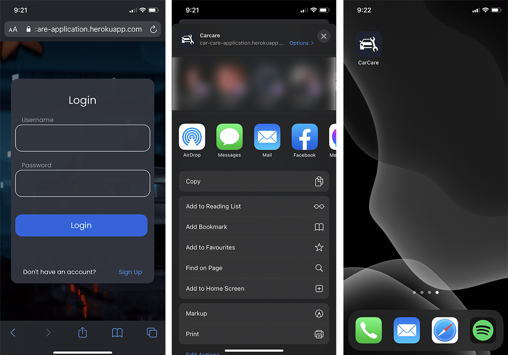

## Belépés és regisztráció

Az oldalra navigáláskor (vagy az alkalmazás megnyitásakor) lehetőségünk van
belépni a felhasználói adataink segítségével, vagy a Sign Up gombra kattintva
regisztrálni az alkalmazásba. Belépés után az alkalmazás betölti a kezdőképernyőt, ahol a fiókunk adatait látjuk, kiléphetünk, illetve elérhetjük a Közösségi oldalt is.

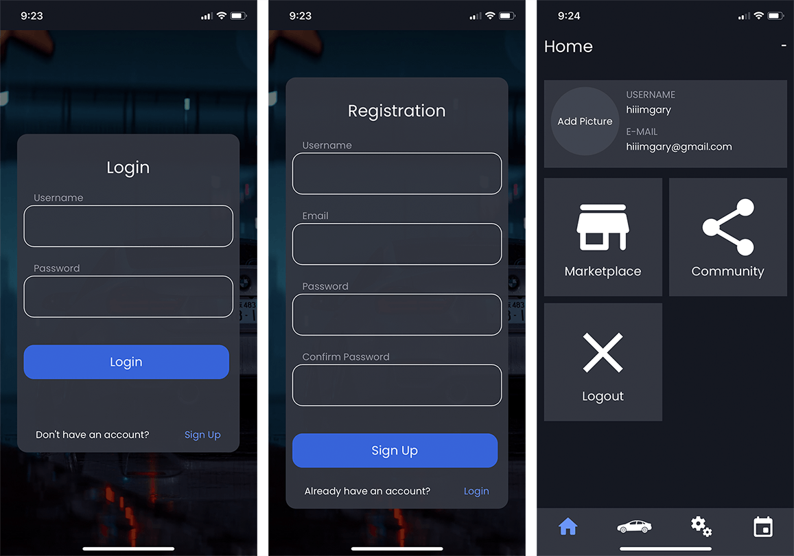

## Profilkép hozzáadása

A profilkép hozzáadásához rá kell nyomnunk az Add Picture feliratra, melynek
hatására egyből megjelenik, hogy most szeretnénk fényképezni, vagy eltöltünk egy meglévő képet. Ha az előbbit választjuk, akkor megnyílik a kamera és tudunk fényképezni anélkül, hogy kilépnénk az alkalmazásból. Ha az utóbbit választjuk, akkor a készülék galériájában böngészhetünk és választhatunk ki egy fotót.

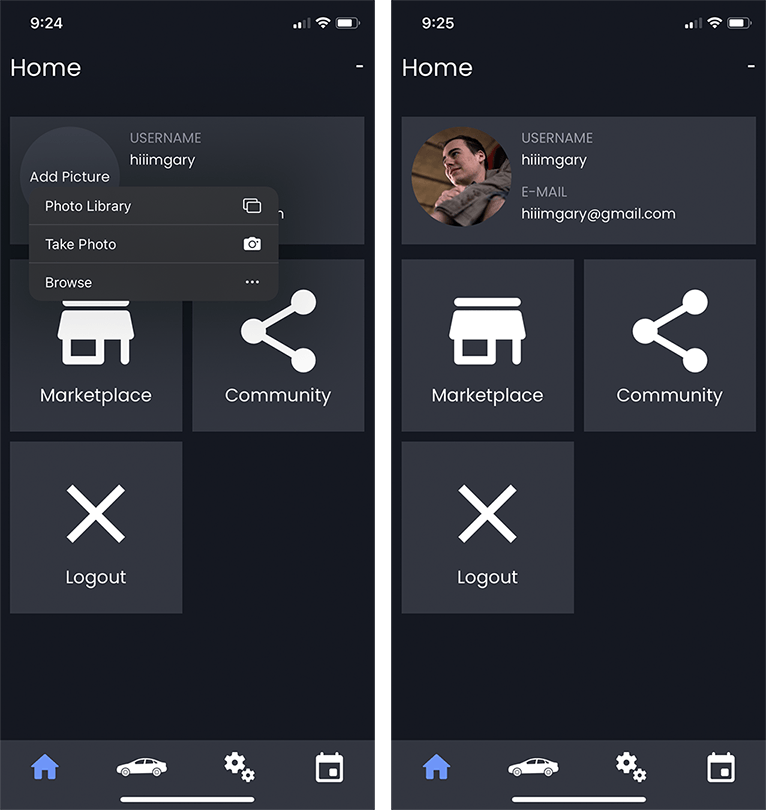

## Autó hozzáadása

Az alsó navigációs sávon az autóra kattintva megjelenik a garázsunk. Itt
láthatjuk a fiókhoz társított járműveket, illetve itt adhatunk hozzá újat a jobb alsó sarokban található plusz gombbal. Ezek után megjelenik az autó hozzáadása oldal, ahol meg kell adni a személygépjármű fontosabb adatait (márka, modell, üzemanyag típusa, rendszám, alvázszám, gyártási év). Ha ezeket megadtuk, elérhetővé válik az autó hozzáadása gomb, melyre rákattintva egyből megjelenik a garázsunkban az újonnan hozzáadott autó.

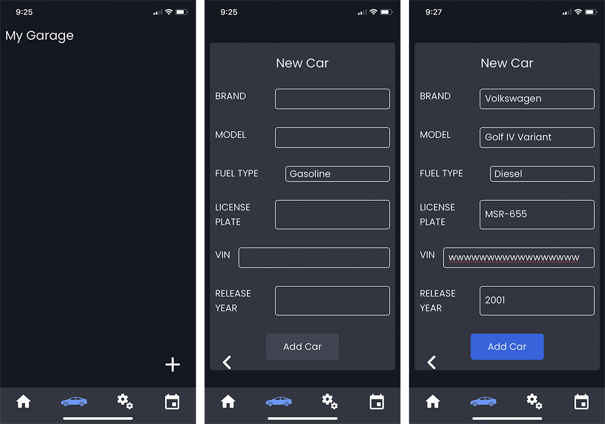

## Kép hozzáadása autóhoz

Az autó információs paneljének jobb oldalán található nyíl segítségével
lenyithatjuk az autó további információit. Itt találunk 4 ikont. A Kép ikonra kattintva megjelennek az autóhoz adott fényképek. A kamera ikonnal hozzáadhatunk új képet az autóról, a letöltés gombbal pedig letölthetjük az autó adatait pdf formátumban. A ceruza ikon segítségével pedig módosíthatjuk az autónk adatait.
Érdemes megjegyezni, hogy több autó hozzáadása esetén az ábrán is látható
Default opcióval kiválaszthatjuk, hogy belépéskor melyik autó legyen aktív. Ha közben másik autó adataihoz szeretnénk hozzáférni, akkor az autóra kattintva kiválaszthatjuk, aminek hatására kék színű lesz.

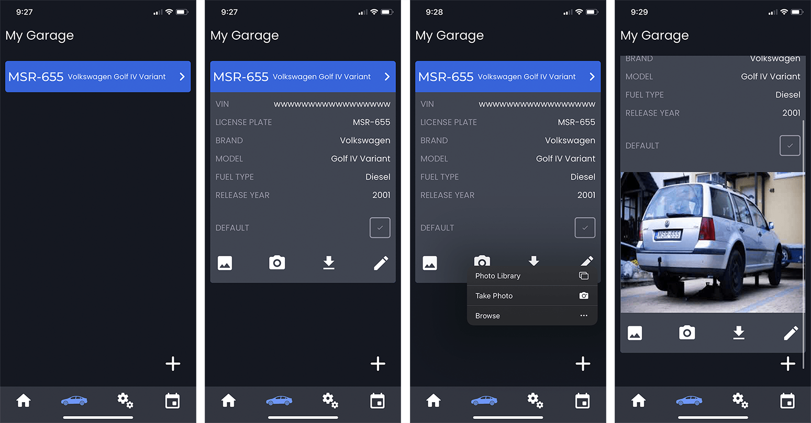

## Szerviz Menü

Az alsó navigációs sávon a fogaskerekekre kattintva megjelennek az autó
fontosabb kiadásai. Itt nézhetjük meg a tankolásainkat, javításainkat, autópálya matricáinkat, illetve biztosításainkat.

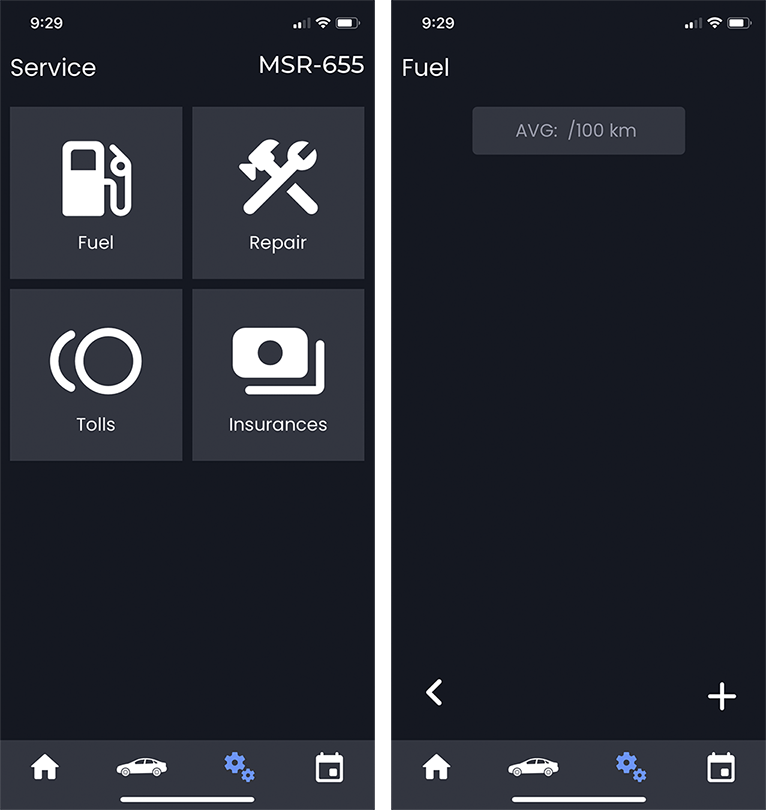

## Tankolás hozzáadása

A Fuel menüponton keresztül elérjük a tankolási bejegyzéseinket. Itt hasonlóan a garázshoz, a jobb alsó sarokban található plusz ikonnal hozzáadhatunk új bejegyzést a tankolásainkhoz.
A dátum mezőre kattintva megnyílik a böngészőbe épített dátum választó, mely
segítségével egy gombnyomásra adhatunk hozzá mai dátumot. Fontos megjegyezni,
hogy pontos intervallumok közti átlagfogyasztást csak akkor tud az alkalmazás
számolni, ha minden tankolás alkalmával teletankoljuk az autót.
Látható, hogy az első tankolásnál nincsen átlagfogyasztás. Ez azért van, mert
nincs előtte lévő bejegyzés, aminek a kilométeróra állásából tudna az alkalmazás átlagfogyasztást számolni. A képernyő tetején középen leolvasható a hosszútávú átlagfogyasztás, melyet az összes megtett útból és az összes tankolási mennyiségből számol az applikáció.

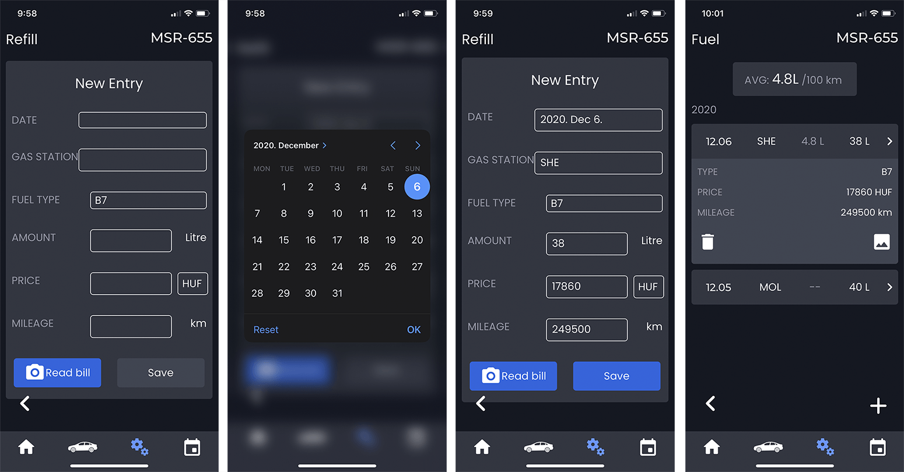

## Javítás hozzáadása

Hasonlóan a tankolási bejegyzésekhez, javításokat is tudjuk vezetni az
alkalmazásban.
Az új javítás hozzáadása oldalon a dátum és a kilométeróra állása mellett
hozzáadhatjuk a számlákat. Ezek mellett kiválaszthatjuk, hogy saját magunk javítottuke a járművet, vagy szervizben volt. Ennek azért van jelentősége, mert ha az utóbbi történt, akkor lehetőségünk van felvinni az autószerviz adatait és a munkadíjat is. Ezek mellett hozzáadhatunk az Add Part gombbal tetszőleges mennyiségű kicserélt alkatrészt is a bejegyzéshez.

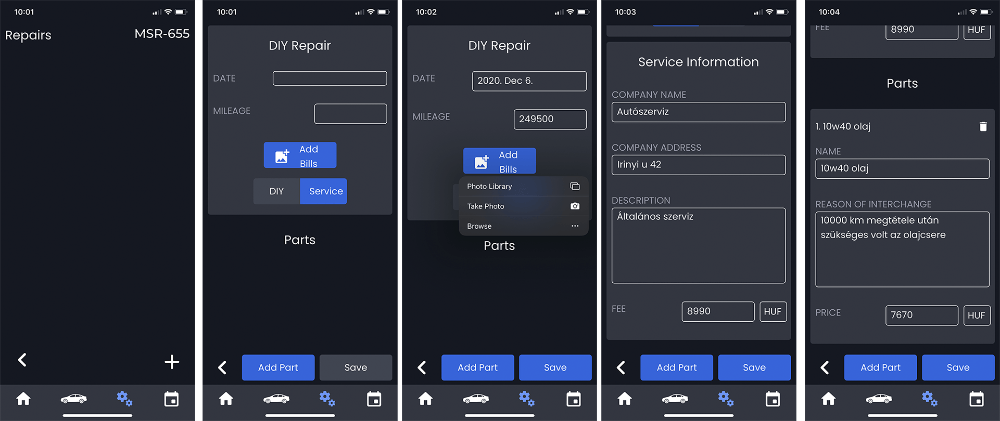

##  Biztosítás hozzáadása

Az alkalmazás lehetőséget biztosít az autó biztosításainak dokumentálására is, legyen az kötelező gépjármű felelősség biztosítás, vagy CASCO. A biztosítás adatainak megadása után hozzáadhatjuk a bejegyzést az autóhoz. Ekkor az alkalmazásba épített határidőnaplóban megjelenik a bejegyzés a következő fizetési határidővel, majd lejárat után dinamikusan megjelenik az új határidő is.

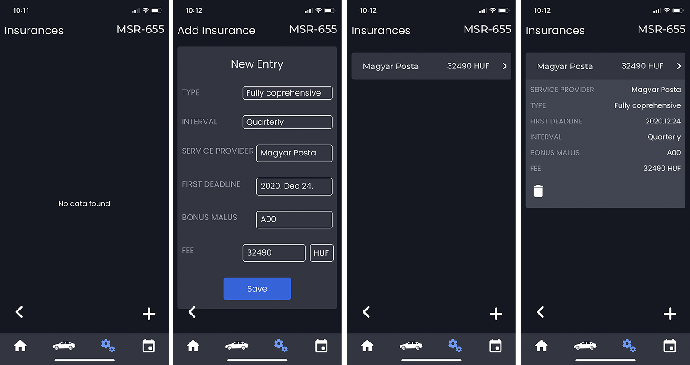

## Határidőnapló

Az alkalmazásba épített, autókhoz rendelt határidőnaplóval egyszerűen
követhetjük nyomon, milyen határidők kapcsolódnak a gépjárműveinkhez. Ahogy azt itt látjuk, az előző fejezetben hozzáadott biztosítás is megjelent. Ha a jobb oldalon található nyílra kattintunk, akkor lenyílik az információs panel, ahol elvégzettnek jelölhetjük a bejegyzést. Ekkor a biztosítás esetében megjelenik a következő intervallumra vonatkozó határidő, így nem szükséges minden bejegyzést manuálisan hozzáadni.
Határidő hozzáadása esetén lehetőségünk van beállítani, hogy ismétlődjön
bizonyos időközönként a bejegyzés. Ekkor lejárat, vagy késznek jelölés alkalmával az applikáció automatikusan hozzáadja az új bejegyzést.

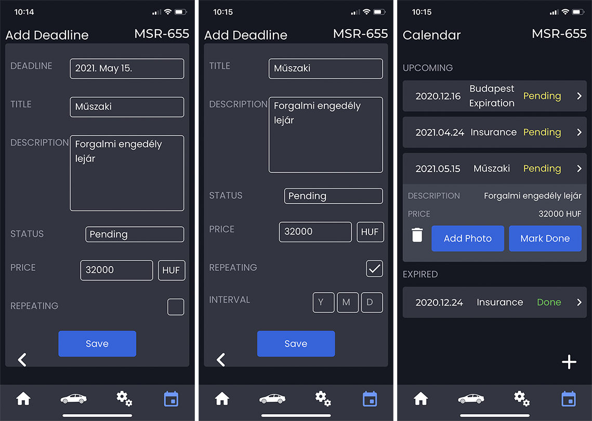

## Közösségi funkció használata

A kezdőképernyőn már látott közösségi oldal használatának követelménye, hogy
rendelkezzen a felhasználó legalább egy autóval. Ennek az az oka, hogy minden
autómárkának külön csoportja van, és csak abba a csoportba jogosult belépni a
felhasználó, amilyen személygépjárművel rendelkezik.
A Community gombra kattintva megjelenik a kiválasztott jármű közösségi
oldala, ahol láthatjuk a jobb felső sarokban, hogy hányan vannak a csoportban. Lehetőségünk van új posztot írni, kommeltelni a posztok alá illetve likeolni a posztokat.

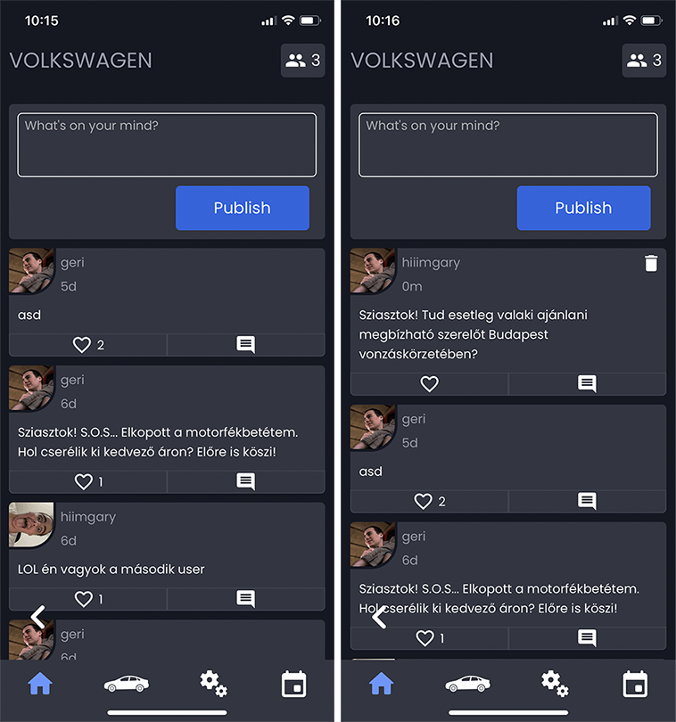
