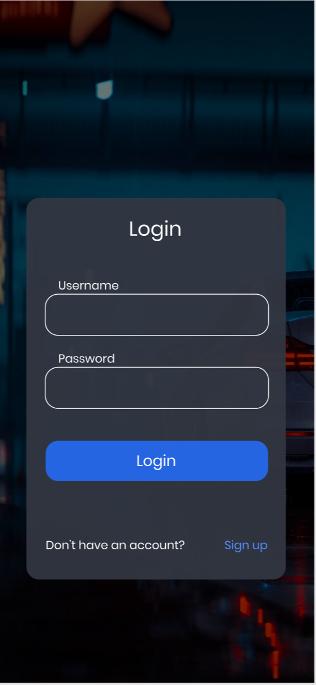
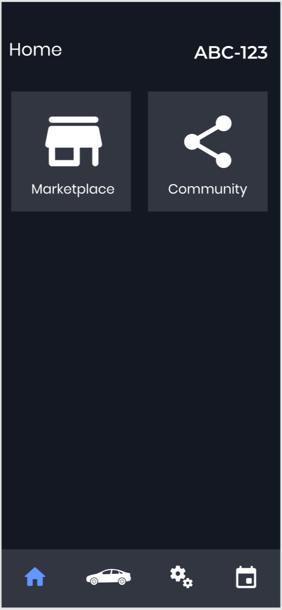
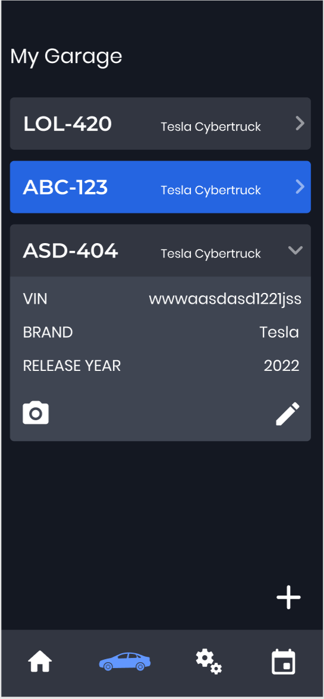
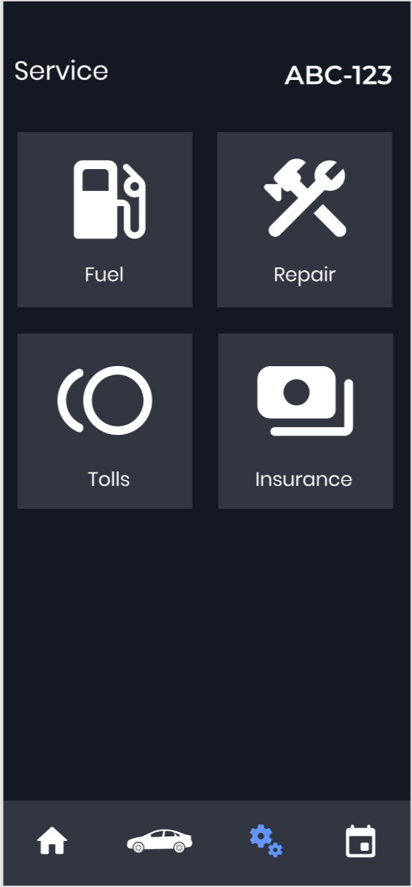
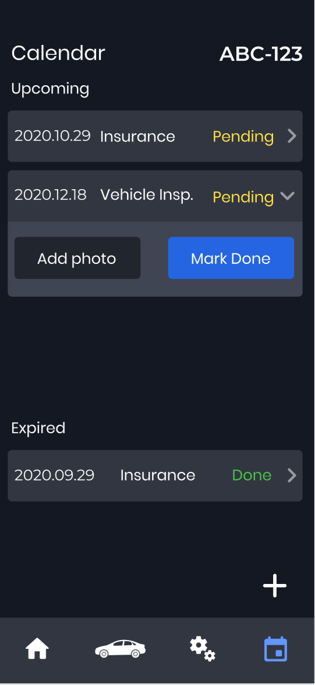
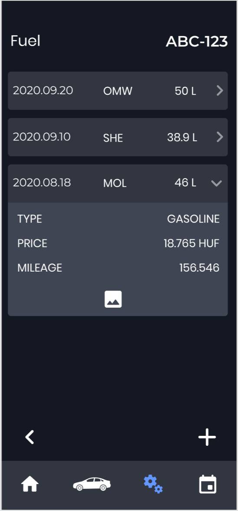
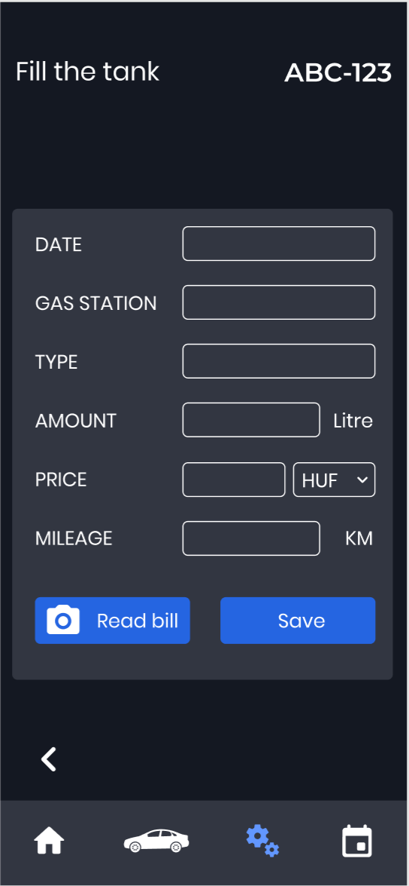

# Funkcionális leírás

## 1. Első használat

 

 A felhasználó az alkalmazás megnyitását követően a belépő képernyőre kerül, ahol be tud jelentkezni a felhasználónév és jelszó megadását követően. Ha még nem rendelkezik fiókkal, akkor lehetősége van a Sign Up gombra nyomva regisztrálni az alkalmazásba.

 

 Belépés után a főképernyőre kerül a felhasználó, melyen a könnyű elérhetőség érdekében a fontos funkciókat az alkalmazás alján található ikonokkal érheti el. Itt található továbbá a piactér illetve a közösségi funkció is.

 

 Alul az autó ikonnal a "Garázsba" navigálhat a felhasználó, ahol a gépjárművei találhatóak. Új autó hozzáadásához meg kell nyomni a + gombot, majd beírni az adatokat. Ezek után felvételre kerül a gépparkba. Minden autóról csak a lényeges információk láthatóak. Több információ a kis nyílra kattintva érhető el. Itt van lehetőség módosítani adatokat, feltölteni képet a járműről, illetve visszanézni azokat. Egy autó kijelölhető ha rányomnak. Ezt a kék szín jelzi. A kijelölt személygépjámű adatai jelennek meg a többi képernyőn. (szerviz, naptár stb.)

 

 A fogaskerekeken keresztül érhetőek el a kölünböző fenntartással kapcsolatos információk. Itt van lehetőség a tankolással kapcsolatos adatokat felvinni, szervízzel kapcsolatos adatokat rögzíteni, autópálya-matricákat hozzáadni az gépjárműhöz, illetve a Kötelező Biztosítást megadni. Ahogy az a jobb felső sarokban is látható, az ABC-123 rendszámú autóval kapcsolatos adatok jelennek meg, ugyanis ez lett kiválasztva a garázsban.

 

 A naptár ikonra kattintva elérhető az autóval kapcsolatos határidők. Fent találhatóak az aktív határidők, melyeket meg lehet jelölni befejezettnek, illetve hozzá lehet adni képet az esetleges számláról. Befejezettnek jelölés után átkerül a lejárt határidőkhöz. Alul a plusz gombra kattintva hozzáadható új határidő és lehetőség van ismétlődőre állítani.

## 2. Leírás folyamat mentén

### 1. Tankolási adatok megadása

 

 Belépést követően ki kell választani a megfelelő járművet, ha ez nincs megtéve. Ehhez az autó ikonra kell kattintani a menüsávban.

 

 A megfelelő jármű kiválasztásához rá kell kattintani, így kékre vált. Ezek után a fogaskerekekre kattinva elérhetőek a jármű szerviz adatai.

 

 A Fuel menüpont kiválasztásával elérhető a tankolás

 

 Itt találhatóak a tankolási előzmények. Alul a plusz gombra kattinva lehet új tankolást hozzáadni.

 

 A Read bill gomb segítségével beolvashatjuk a blokkot és amellett, hogy elmenti a képet, az alkalmazás megpróbálja kitölteni az adatokat a fényképről leolvasott információk segítségével. Ha ez nem sikerül, manuálisan be lehet gépelni azokat. Ezek után el kell menteni a változtatásokat, és így megjelenik a tankolások között.

